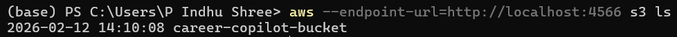
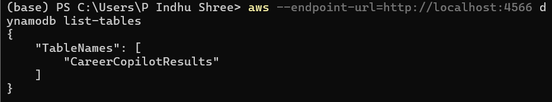
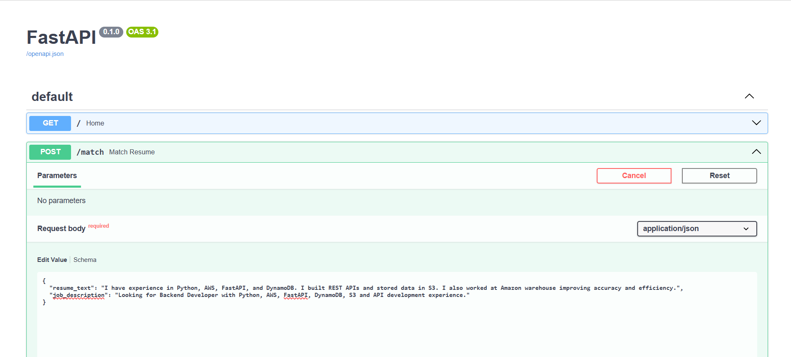

# 🤖 Career Copilot (GenAI Resume Matcher) - LocalStack + Ollama + FastAPI


This project demonstrates a **Generative AI powered Resume Matching System** by integrating a **local LLM (Ollama)** with a backend API built using **FastAPI**, and storing results using AWS services simulated locally via **LocalStack Community Edition** running inside **Docker**.

When a user submits **resume text + job description**, the FastAPI backend sends a structured prompt to the LLM, generates an **ATS-style evaluation**, stores the final JSON output in **S3**, and saves metadata into a **DynamoDB table**.

💡 This project was built to gain hands-on experience with **GenAI + Cloud workflows** without requiring a paid AWS account.

---

## 🚀 Key Features

✅ Resume vs Job Description matching (ATS-style evaluation)  
✅ Generates match score (0–100)  
✅ Extracts missing keywords  
✅ Highlights strengths & improvement areas  
✅ Suggests improved resume bullet points  
✅ Generates cover letter introduction  
✅ Stores AI output JSON in:
- **S3 `results/` folder**
- **DynamoDB table** (metadata storage)  
✅ Fully testable using Swagger UI (`/docs`)

---

## 🏗️ Architecture (GenAI + Cloud Workflow)

### 🔄 Workflow Steps

1. User submits Resume + Job Description through Swagger UI / Postman
2. FastAPI backend sends structured prompt to Ollama (local LLM)
3. Ollama generates structured JSON analysis output
4. FastAPI stores output JSON into LocalStack S3 bucket (`results/`)
5. FastAPI stores metadata into LocalStack DynamoDB table

---

### 📌 Architecture Flow Diagram

```text
User (Swagger UI / Postman)
        |
        v
FastAPI Backend (Uvicorn)
        |
        v
Ollama (Local LLM Model)
(Llama3 / Phi3 Mini)
        |
        v
AI Resume Analysis Output (JSON)
        |
        +------------------------------+
        |                              |
        v                              v
LocalStack S3 Bucket                LocalStack DynamoDB Table
career-copilot-bucket               CareerCopilotResults
(results/<request_id>.json)         (request_id, score, timestamp)
```
---
📷 Architecture image available in:
`architecture/Architecture.png`

---

## 🛠️ Technologies Used
*Docker
*LocalStack (AWS service simulation)
*AWS CLI
*Python 3.12+
*FastAPI
*Uvicorn
*Ollama (Local LLM inference)
*Amazon S3 (Simulated)
*Amazon DynamoDB (Simulated)
---

## 📂 Project Structure

```text
02-career-copilot-genai/
│
├── backend/
│   ├── app.py
│   └── requirements.txt
│
├── architecture/
│   └── architecture.png
│
├── sample-output/
│   └── sample-result.json
│
├── screenshots/
│   ├── swagger-ui.png
│   ├── swagger-response.png
│   ├── s3-results.png
│   ├── dynamodb-scan.png
│
└── README.md
```

---

## ⚙️ Prerequisites
Install the following tools before running the project:
*Docker Desktop
*Python 3.12+
*AWS CLI
*Ollama (Local LLM)

---

## 🚀 Setup and Execution

---

### 1️⃣ Start LocalStack using Docker
```bash
docker run --rm -it -p 4566:4566 localstack/localstack
```
### 2️⃣ Configure AWS CLI Credentials (Windows PowerShell)

```powershell
$env:AWS_ACCESS_KEY_ID="test"
$env:AWS_SECRET_ACCESS_KEY="test"
$env:AWS_DEFAULT_REGION="us-east-1"
```

###3️⃣ Test LocalStack Connection
```powershell
aws --endpoint-url=http://localhost:4566 s3 ls
```

###4️⃣ Create an S3 Bucket
```powershell
aws --endpoint-url=http://localhost:4566 s3 mb s3://career-copilot-bucket
```

###5️⃣ Create a DynamoDB Table
```powershell
aws --endpoint-url=http://localhost:4566 dynamodb create-table `
  --table-name CareerCopilotResults `
  --attribute-definitions AttributeName=request_id,AttributeType=S `
  --key-schema AttributeName=request_id,KeyType=HASH `
  --billing-mode PAY_PER_REQUEST
```

###6️⃣ Verify DynamoDB Table Creation
```powershell
aws --endpoint-url=http://localhost:4566 dynamodb list-tables
```

##🤖 Ollama Setup (Local GenAI Model)
```powershell
###7️⃣ Install Ollama
Download Ollama from: https://ollama.com/
```

###8️⃣ Download Llama3 Model
```powershell
ollama pull llama3
```

###9️⃣ (Optional) Download a Smaller Model (Phi3 Mini)
```powershell
ollama pull phi3:mini
```

###🔟 Verify Installed Ollama Models
```powershell
ollama list
```

##🧠 FastAPI Backend Setup
```powershell
###1️⃣ Navigate into Backend Folder
cd backend
```

###2️⃣ Install Python Dependencies
```powershell
pip install -r requirements.txt
```

###3️⃣ Run FastAPI Server
```powershell
uvicorn app:app --reload
```

##🧪 Testing the API (Swagger UI)
###4️⃣ Open Swagger UI
```powershell
http://127.0.0.1:8000/docs
```

###5️⃣ Test Endpoint (POST /match)
```powershell
{
  "resume_text": "I have experience in Python, AWS, FastAPI, and DynamoDB.",
  "job_description": "Looking for Backend Developer with Python, AWS, DynamoDB and API development experience."
}
```

📤 Output Storage
###6️⃣ View Stored Results in S3
```powershell
aws --endpoint-url=http://localhost:4566 s3 ls s3://career-copilot-bucket/results/
```

###7️⃣ View Stored Records in DynamoDB
```powershell
aws --endpoint-url=http://localhost:4566 dynamodb scan --table-name CareerCopilotResults
```

### Sample Output

Example JSON output stored in:
results/<request_id>.json

Example output:
```powershell
{
  "request_id": "b0b1c2d3-1234-5678-9999-acde12345678",
  "timestamp": "2026-02-12T12:15:00Z",
  "bucket": "career-copilot-bucket",
  "s3_key": "results/b0b1c2d3-1234-5678-9999-acde12345678.json",
  "match_score": 85,
  "missing_keywords": ["Docker", "CI/CD", "REST API"],
  "strengths": ["Python experience", "AWS knowledge"],
  "improvements": ["Add more backend project examples"],
  "recommended_resume_bullets": [
    "Built a FastAPI-based GenAI Resume Matching backend using Ollama and LocalStack."
  ],
  "cover_letter_intro": "I am excited to apply for this role because..."
}
```

---

## 📸 Screenshots

Proof of execution screenshots:

### 📌 S3 Bucket



### 📌 DynamoDB Table



### 📌 Swagger UI Resume in Text



### 📌 Swagger UI Resume in docs


---

## 📌 Notes
⚠️ This project uses LocalStack Community Edition, so AWS services are simulated locally.

✅ The same workflow can be deployed to real AWS by replacing LocalStack endpoints with actual AWS services.
---

## 👩‍💻 Author

**Indhu Shree Prakash**  
📍 Master's Student | Cloud & Data Engineering Enthusiast  
🚀 Exploring AWS Serverless, DevOps & AI Workflows


---
