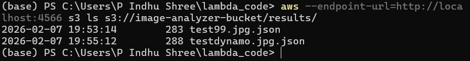
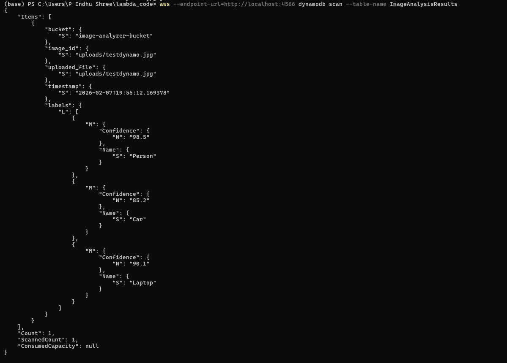

# 🖼️ Serverless Image Analyzer (LocalStack + Docker)


This project demonstrates an **event-driven serverless architecture** by simulating AWS services locally using **LocalStack Community Edition** running inside **Docker**.

When an image file is uploaded into the `uploads/` folder in an S3 bucket (simulated using LocalStack), an **S3 ObjectCreated event** automatically triggers a **Lambda function**. The Lambda performs **mock image analysis (simulated AI label detection)**, stores the result as a JSON file in the `results/` folder, and saves metadata into a **DynamoDB table**.

💡 This project was built to gain hands-on experience with AWS serverless workflows **without requiring a paid AWS account**.

---

## 🚀 Key Features

✅ Local AWS simulation using **LocalStack Community Edition**  
✅ Docker-based environment (**portable & reproducible**)  
✅ Uploading a file triggers processing automatically (**event-driven system**)  
✅ Lambda generates mock AI labels and metadata  
✅ Output stored in:
- **S3 `results/` folder** (JSON output)
- **DynamoDB table** (metadata storage)

---

## 🏗️ Architecture (Event-Driven Workflow)

### 🔄 Workflow Steps

1. User uploads an image into **S3 `uploads/`**
2. S3 event triggers the **Lambda function**
3. Lambda processes the uploaded file and generates mock labels
4. Lambda stores output JSON into **S3 `results/`**
5. Lambda inserts metadata into **DynamoDB**

### 📌 Architecture Flow Diagram

```text
User Upload (AWS CLI)
        |
        v
LocalStack S3 Bucket (uploads/)
        |
        v
S3 ObjectCreated Event Trigger
        |
        v
LocalStack Lambda Function
        |
        +----------------------------+
        |                            |
        v                            v
S3 results/ folder (JSON Output)   DynamoDB Table (Metadata Storage)
````

📷 Architecture image available in:
`architecture/architecture.png`

---

## 🛠️ Technologies Used

* Docker
* LocalStack (AWS service simulation)
* AWS CLI
* Python 3.12+
* Amazon S3 (Simulated)
* AWS Lambda (Simulated)
* Amazon DynamoDB (Simulated)

---

## 📂 Project Structure

```text
01-serverless-image-analyzer-localstack/
│
├── lambda_code/
│   └── lambda_function.py
│
├── architecture/
│   └── architecture.png
│
├── sample-output/
│   └── testdynamo.jpg.json
│
├── screenshots/
│   ├── s3-uploads.png
│   ├── s3-results.png
│   └── dynamodb-scan.png
│
└── README.md
```

---

## ⚙️ Prerequisites

Install the following tools before running the project:

* Docker Desktop
* Python 3.12+
* AWS CLI

---

## 🚀 Setup and Execution

---

### 1️⃣ Start LocalStack using Docker

Run LocalStack container:

```bash
docker run --rm -it -p 4566:4566 -p 4510-4559:4510-4559 \
-e SERVICES=s3,lambda,dynamodb \
-v /var/run/docker.sock:/var/run/docker.sock \
localstack/localstack
```

LocalStack will run at:

```text
http://localhost:4566
```

---

### 2️⃣ Configure AWS CLI Credentials (Windows PowerShell)

LocalStack accepts dummy credentials:

```powershell
$env:AWS_ACCESS_KEY_ID="test"
$env:AWS_SECRET_ACCESS_KEY="test"
$env:AWS_DEFAULT_REGION="us-east-1"
```

Test connection:

```powershell
aws --endpoint-url=http://localhost:4566 s3 ls
```

---

### 3️⃣ Create an S3 Bucket

```powershell
aws --endpoint-url=http://localhost:4566 s3 mb s3://image-analyzer-bucket
```

---

### 4️⃣ Create a DynamoDB Table

```powershell
aws --endpoint-url=http://localhost:4566 dynamodb create-table `
  --table-name ImageAnalysisResults `
  --attribute-definitions AttributeName=image_id,AttributeType=S `
  --key-schema AttributeName=image_id,KeyType=HASH `
  --billing-mode PAY_PER_REQUEST
```

Verify table creation:

```powershell
aws --endpoint-url=http://localhost:4566 dynamodb list-tables
```

---

## 🧠 Lambda Deployment

---

### 5️⃣ Create Lambda ZIP Package (Windows PowerShell)

Navigate into Lambda folder:

```powershell
cd lambda_code
```

Zip the Lambda function:

```powershell
Compress-Archive -Path lambda_function.py -DestinationPath function.zip -Force
```

---

### 6️⃣ Create Lambda Function

```powershell
aws --endpoint-url=http://localhost:4566 lambda create-function `
  --function-name image-analyzer-lambda `
  --runtime python3.12 `
  --handler lambda_function.lambda_handler `
  --role arn:aws:iam::000000000000:role/lambda-role `
  --zip-file fileb://function.zip
```

---

### 7️⃣ Allow S3 to Invoke Lambda

```powershell
aws --endpoint-url=http://localhost:4566 lambda add-permission `
  --function-name image-analyzer-lambda `
  --statement-id s3invoke1 `
  --action lambda:InvokeFunction `
  --principal s3.amazonaws.com `
  --source-arn arn:aws:s3:::image-analyzer-bucket
```

---

## 🔔 Enable S3 Event Trigger

---

### 8️⃣ Create Notification Configuration File

Create a file named `notification.json` in the project root folder:

```json
{
  "LambdaFunctionConfigurations": [
    {
      "Id": "UploadTrigger",
      "LambdaFunctionArn": "arn:aws:lambda:us-east-1:000000000000:function:image-analyzer-lambda",
      "Events": ["s3:ObjectCreated:*"],
      "Filter": {
        "Key": {
          "FilterRules": [
            { "Name": "prefix", "Value": "uploads/" }
          ]
        }
      }
    }
  ]
}
```

---

### 9️⃣ Attach Notification Trigger to S3 Bucket

```powershell
aws --endpoint-url=http://localhost:4566 s3api put-bucket-notification-configuration `
  --bucket image-analyzer-bucket `
  --notification-configuration file://notification.json
```

Verify trigger:

```powershell
aws --endpoint-url=http://localhost:4566 s3api get-bucket-notification-configuration --bucket image-analyzer-bucket
```

---

## 📤 Upload Image to Trigger Lambda

---

### 🔟 Upload an Image into `uploads/`

Create a test image file:

```bash
echo "test image" > testdynamo.jpg
```

Upload to S3:

```powershell
aws --endpoint-url=http://localhost:4566 s3 cp testdynamo.jpg s3://image-analyzer-bucket/uploads/testdynamo.jpg
```

This automatically triggers the Lambda function.

---

## ✅ Verification

---

### ✅ Check uploaded file in `uploads/`

```powershell
aws --endpoint-url=http://localhost:4566 s3 ls s3://image-analyzer-bucket/uploads/
```

---

### ✅ Check generated JSON output in `results/`

```powershell
aws --endpoint-url=http://localhost:4566 s3 ls s3://image-analyzer-bucket/results/
```

---

### ✅ Check DynamoDB table records

```powershell
aws --endpoint-url=http://localhost:4566 dynamodb scan --table-name ImageAnalysisResults
```

---

## 📄 Sample Output

The JSON output will be stored in:

```text
results/testdynamo.jpg.json
```

Example output:

```json
{
  "bucket": "image-analyzer-bucket",
  "image_id": "uploads/testdynamo.jpg",
  "uploaded_file": "uploads/testdynamo.jpg",
  "timestamp": "2026-02-07T19:55:12.169378",
  "labels": [
    { "Name": "Person", "Confidence": 98.5 },
    { "Name": "Car", "Confidence": 85.2 },
    { "Name": "Laptop", "Confidence": 90.1 }
  ]
}
```

---

## 📸 Screenshots

Proof of execution screenshots:

### 📌 S3 Upload Folder Proof


### 📌 S3 Results Folder Proof



### 📌 DynamoDB Scan Output Proof



---

## 📌 Notes

⚠️ This project uses mock AI label detection because Amazon Rekognition is not fully supported in LocalStack Community Edition.

✅ The same workflow can be deployed to real AWS by replacing the mock logic with AWS Rekognition API calls.

---

## 👩‍💻 Author

**Indhu Shree Prakash**
📍 Master's Student | Cloud & Data Engineering Enthusiast
🚀 Exploring AWS Serverless, DevOps & AI Workflows

````

---
